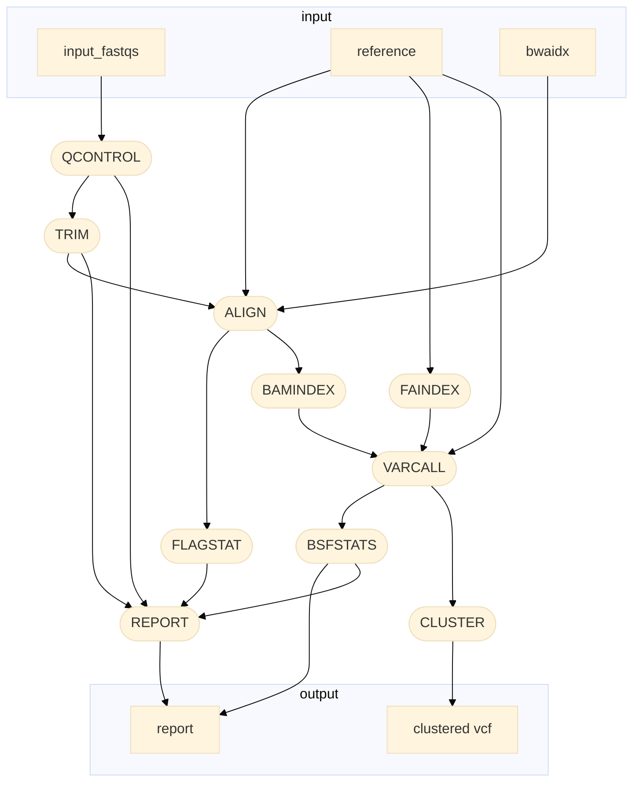

# gbs
Call GBS using custom R scripts for clustering (on cows)

## Contributors

- Oxana Kolpakova ([@OxanaKolpakova](https://github.com/OxanaKolpakova))
- Glebus Aleksandr ([@glebus-sasha](https://github.com/glebus-sasha/))
