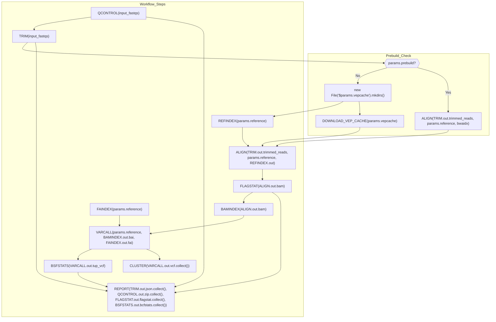

# gbs
Call GBS using custom R scripts for clustering (on cows)

```mermaid
graph TD
    QCONTROL --> TRIM
    TRIM --> DECIDE_PREBUILD{{"params.prebuild?"}}
    DECIDE_PREBUILD -- No --> MKDIR
    DECIDE_PREBUILD -- Yes --> ALIGN_PREBUILT
    MKDIR --> REFINDEX
    MKDIR --> DOWNLOAD_VEP_CACHE
    REFINDEX --> ALIGN
    DOWNLOAD_VEP_CACHE --> ALIGN
    ALIGN_PREBUILT --> ALIGN
    ALIGN --> FLAGSTAT
    FLAGSTAT --> BAMINDEX
    BAMINDEX --> VARCALL
    VARCALL --> BSFSTATS
    BSFSTATS --> REPORT
    TRIM --> REPORT
    QCONTROL --> REPORT
    FLAGSTAT --> REPORT
    VARCALL --> CLUSTER
    FAINDEX --> VARCALL

    subgraph Prebuild_Check
        direction TB
        DECIDE_PREBUILD
        MKDIR["new File('$params.vepcache').mkdirs()"]
        DOWNLOAD_VEP_CACHE["DOWNLOAD_VEP_CACHE(params.vepcache)"]
        ALIGN_PREBUILT["ALIGN(TRIM.out.trimmed_reads, params.reference, bwaidx)"]
    end

    subgraph Workflow_Steps
        direction TB
        QCONTROL["QCONTROL(input_fastqs)"]
        TRIM["TRIM(input_fastqs)"]
        REFINDEX["REFINDEX(params.reference)"]
        ALIGN["ALIGN(TRIM.out.trimmed_reads, params.reference, REFINDEX.out)"]
        FLAGSTAT["FLAGSTAT(ALIGN.out.bam)"]
        BAMINDEX["BAMINDEX(ALIGN.out.bam)"]
        FAINDEX["FAINDEX(params.reference)"]
        VARCALL["VARCALL(params.reference, BAMINDEX.out.bai, FAINDEX.out.fai)"]
        BSFSTATS["BSFSTATS(VARCALL.out.tup_vcf)"]
        REPORT["REPORT(TRIM.out.json.collect(), QCONTROL.out.zip.collect(), FLAGSTAT.out.flagstat.collect(), BSFSTATS.out.bcfstats.collect())"]
        CLUSTER["CLUSTER(VARCALL.out.vcf.collect())"]
    end

```
